<h1 align="center">Cat Paywall Compose</h1></br>

<p align="center">
  <a href="https://opensource.org/licenses/Apache-2.0"></a>
  <a href="https://android-arsenal.com/api?level=24"></a>
  <a href="https://github.com/revenuecat/cat-paywall-compose/actions/workflows/android.yml"></a>
</p>

🐈 Cat Paywall Compose shows you how to build a paywall for Google Play's billing system using [RevenueCat's Android SDK](https://www.revenuecat.com/docs/getting-started/quickstart) and Jetpack Compose.

The purpose of this repository is to demonstrate the following:

- In-app purchases (subscriptions) using Google Play Billing.
- RevenueCat's server-driven UI paywall builder.
- Full UI implementation using Jetpack Compose.
- Configuring structures with the Android architecture and Jetpack libraries such as Hilt and Jetpack Navigation.
- A multi-module project structure and using Baseline Profiles to enhance app performance.

## 📷 Previews

<p align="center">

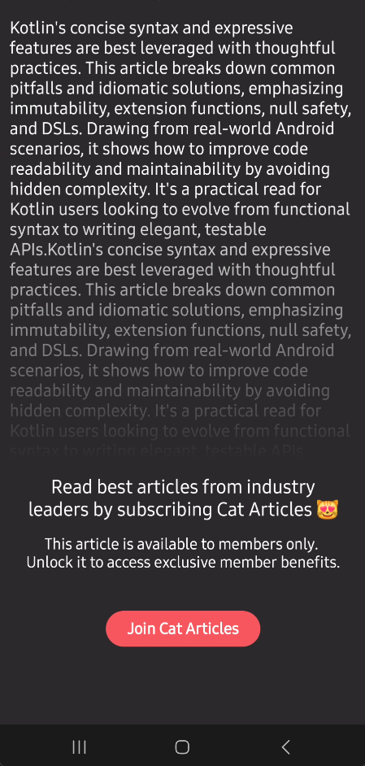
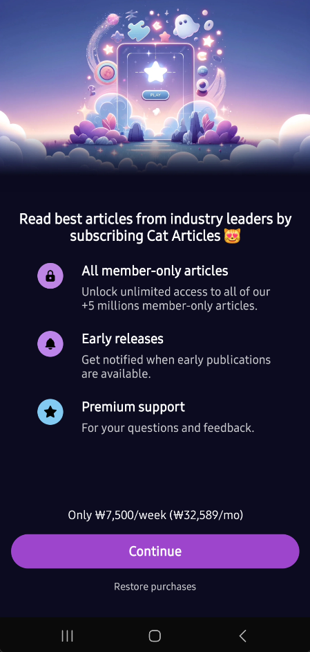
</p>

<a href="https://www.revenuecat.com/docs/getting-started/quickstart?utm_medium=organic&utm_source=github&utm_campaign=advocate">

</a>

## 🐈 RevenueCat In-App Purchase SDK

Cat Paywall Compose is built using the [RevenueCat SDK for Android](https://www.revenuecat.com/docs/getting-started/installation/android?utm_medium=organic&utm_source=github&utm_campaign=advocate) to implement in-app subscriptions and a paywall system on top of Google Play Billing. [RevenueCat](https://www.revenuecat.com?utm_medium=organic&utm_source=github&utm_campaign=advocate) handles first-party purchases, manages customer data, supports A/B testing, and provides source-of-truth analytics across multiple platforms.

## 🛠 Tech Stack & Open Source Libraries
- Minimum SDK level 24.
- 100% [Jetpack Compose](https://developer.android.com/jetpack/compose) based + [Coroutines](https://github.com/Kotlin/kotlinx.coroutines) + [Flow](https://kotlin.github.io/kotlinx.coroutines/kotlinx-coroutines-core/kotlinx.coroutines.flow/) for asynchronous.
- [RevenueCat SDK for Android](https://www.revenuecat.com/docs/getting-started/installation/android?utm_medium=organic&utm_source=github&utm_campaign=advocate): RevenueCat allows you to implement in-app subscriptions, dynamic paywalls, actionable analytics, and plug-and-play experimentation tools.
- Jetpack
  - Compose: Modern Android toolkits for building native UI.
  - ViewModel: UI related data holder and lifecycle-aware.
  - Navigation: For navigating screens and [Hilt Navigation Compose](https://developer.android.com/jetpack/compose/libraries#hilt) for injecting dependencies.
  - [Hilt](https://dagger.dev/hilt/): Dependency Injection.
- [Retrofit2 & OkHttp3](https://github.com/square/retrofit): Construct the REST APIs and paging network data.
- [Sandwich](https://github.com/skydoves/Sandwich): Construct a lightweight and modern response interface to handle network payload for Android.
- [Baseline Profiles](https://medium.com/proandroiddev/improve-your-android-app-performance-with-baseline-profiles-297f388082e6): To improve app performance by including a list of classes and methods specifications in your APK that can be used by Android Runtime.

## 💻 How to Build The Project

1. Start by logging in into [Google Play Console](https://play.google.com/console) and create an in-app product or subscription like the image below:

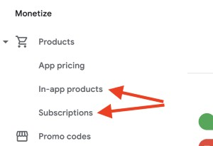

In the sidebar, open the **Products** dropdown and select either **In-app products** or **Subscriptions**, depending on the type of in-app product you're creating. For more details, you can follow the [Google Play Product Setup](https://www.revenuecat.com/docs/getting-started/entitlements/android-products?utm_medium=organic&utm_source=github&utm_campaign=advocate) instructions.

2. [Set up your RevenueCat account](https://app.revenuecat.com/signup?utm_medium=organic&utm_source=github&utm_campaign=advocate) for managing the products, monetization, statistics, and more. All you need is an email address.

3. After creating your account on RevenueCat, configure a set of Google Play Store service credentials by following the instructions provided in the [Google Play Store service credentials guide](https://www.revenuecat.com/docs/service-credentials/creating-play-service-credentials?utm_medium=organic&utm_source=github&utm_campaign=advocate). In order for RevenueCat's servers to communicate with Google on your behalf, you should complete the steps below:
   1. [Enable the Google Developer and Reporting API](https://www.revenuecat.com/docs/service-credentials/creating-play-service-credentials#1-enable-the-google-developer-and-reporting-api?utm_medium=organic&utm_source=github&utm_campaign=advocate)
   2. [Create a Service Account](https://www.revenuecat.com/docs/service-credentials/creating-play-service-credentials#2-create-a-service-account?utm_medium=organic&utm_source=github&utm_campaign=advocate)
   3. [Grant Financial Access to RevenueCat](https://www.revenuecat.com/docs/service-credentials/creating-play-service-credentials#3-grant-financial-access-to-revenuecat?utm_medium=organic&utm_source=github&utm_campaign=advocate)
   4. [Enter the Credentials JSON in RevenueCat](https://www.revenuecat.com/docs/service-credentials/creating-play-service-credentials#4-enter-the-credentials-json-in-revenuecat?utm_medium=organic&utm_source=github&utm_campaign=advocate)

Once your project is connected to a store, RevenueCat can automatically import products from it.

To do this, go to the **Products** tab in your project settings on the RevenueCat dashboard, click the **+ New** button, and select **Import Products**. A list of available store products will be displayed for import.

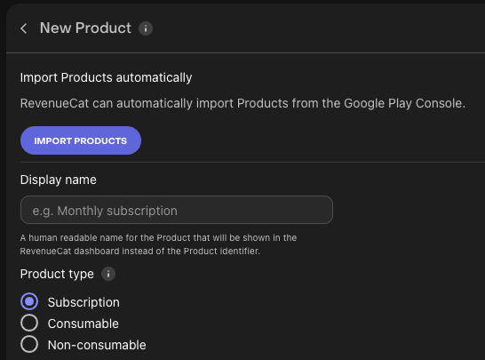

After importing your products, you'll see that the in-app purchase items have been successfully imported, as shown in the image below:

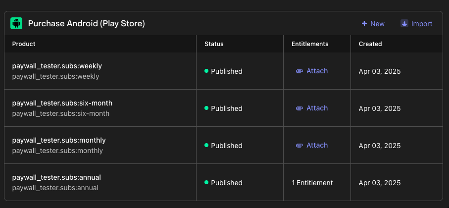

4. Next, you should create **[Offerings](https://www.revenuecat.com/docs/offerings/overview?utm_medium=organic&utm_source=github&utm_campaign=advocate)**. Offerings represent the set of products that are presented to users on your paywall. You can create a new offering following the [Creating an Offering](https://www.revenuecat.com/docs/offerings/overview#creating-an-offering?utm_medium=organic&utm_source=github&utm_campaign=advocate) guide. Once you've created a new offering, you'll see the result below:

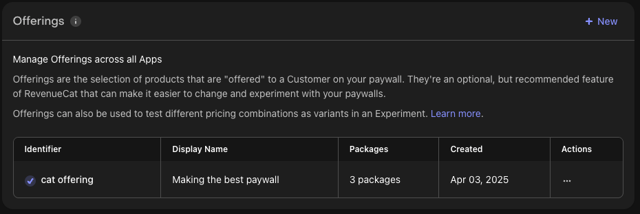

5. Now you can create [Paywalls](https://www.revenuecat.com/docs/tools/paywalls?utm_medium=organic&utm_source=github&utm_campaign=advocate) within the RevenueCat dashboard. To do this, go to the **Paywalls** tab in your project settings on the RevenueCat dashboard, click the **+ New** button, then you'll see the template screen like the image below:

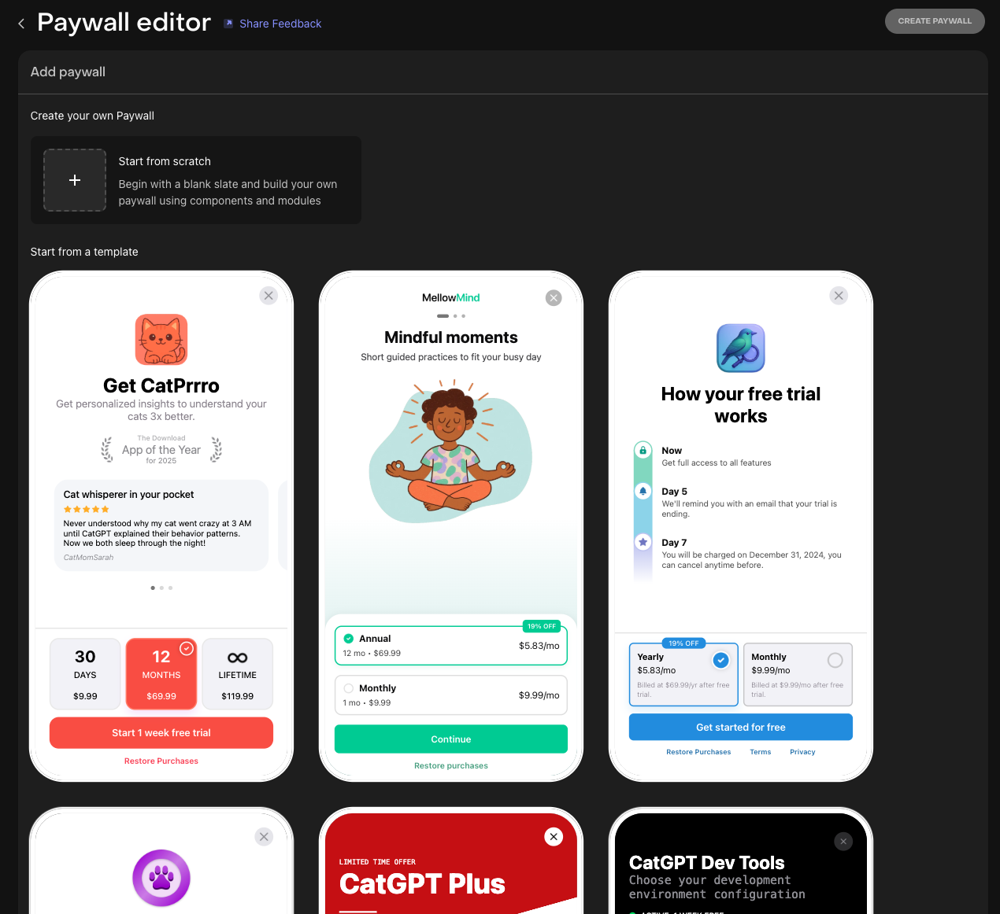

You can either choose one of the available templates or start from scratch. If you select a template, you’ll be taken to the Paywall Editor screen:

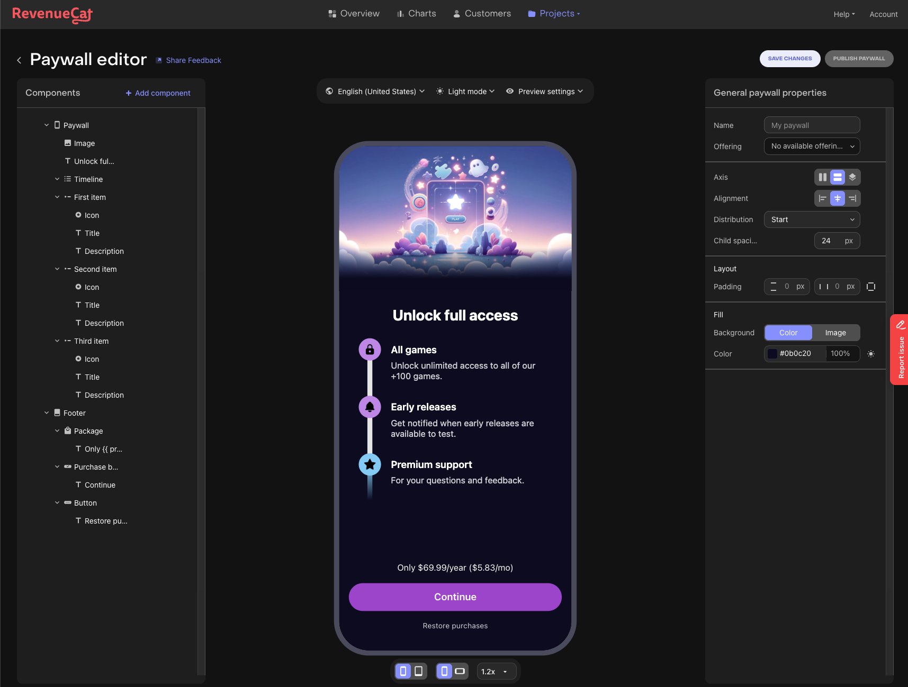

In the Paywall Editor, similar to working in Figma, you can design and modify the entire paywall UI. Once you've made your changes, click **Save Changes** and then **Publish Paywall**. The updated paywall design will automatically be delivered to all customers (Android & iOS) using a server-driven UI approach.

6. Lastly, you should get the RevenueCat API key from the dashboard. If you go to the **API Keys** tab in your project settings on the RevenueCat dashboard, you'll see the result below:

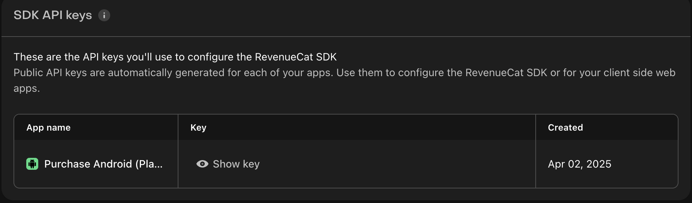

Click the **Show key** button and get the API key. Then, create a new file named `secrets.properties` on the root project folder, and fill in the line below with the API key:

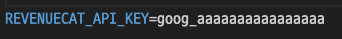

You can copy-paste the line below:

```
REVENUECAT_API_KEY=<YOUR_API_KEY>
```

Now, build and run the project. You should see the paywall dialog appear in the details screen if you've followed the steps correctly.

> **Note:** Ensure your device is signed into Google Play, especially if you're running the project on an emulator.

## 🏛️ Architecture

This project follows [Google's official architecture guidance](https://developer.android.com/topic/architecture).

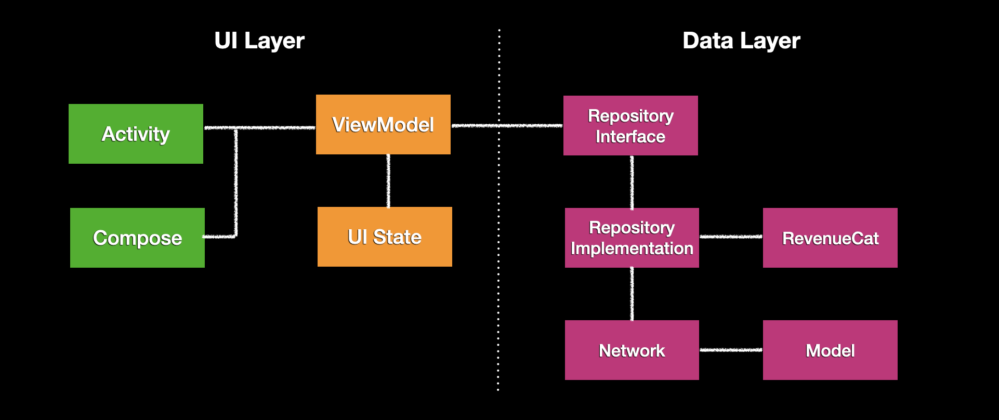

### UI Layer

The UI Layer consists of UI elements like buttons, menus, and tabs that users could interact with, and UI state holder, [ViewModel](https://developer.android.com/topic/libraries/architecture/viewmodel), that holds app states and restores data when configurations change. 

UI layer = UI elements + ViewModels (UI State).

The pattern in which state flows downward and events flow upward is known as **unidirectional data flow (UDF)**. This architecture promotes a clear separation of concerns and predictable UI behavior through the following structure:

- The **ViewModel** serves as the source of truth for the UI state, transforming application data into a format suitable for rendering.
- **UI** elements observes this state and render the content accordingly.
- When a user interacts with the UI elements, events are sent upward to the ViewModel.
- The **ViewModel** processes these events, updates the state as needed, and the new state is emitted back to the UI.
- This cycle repeats for every event that results in a state change.

In the context of screen-level navigation or destinations, the ViewModel interacts with the data layer to fetch and transform data into UI state, while also incorporating the outcomes of user-driven events that affect that state.

### Data Layer

The data layer consists of repository classes, each responsible for managing a specific type of data in the app. A repository may interact with one or more data sources, and it's recommended to create a separate repository for each distinct data domain. 

In this project, the data layer primarily communicates with remote sources (network), including the RevenueCat backend—most interactions are handled by the SDK, allowing direct use within the repositories.

Repositories are responsible for:

- Exposing data to the rest of the app.
- Centralizing and coordinating data operations.
- Resolving conflicts when multiple data sources are involved.
- Abstracting the underlying data sources from higher layers.
- Containing business logic related to data management.

## 🤝 Contribution

Anyone can contribute and improve this project following the [Contributing Guideline](https://github.com/revenuecat/cat-paywall-compose/blob/main/CONTRIBUTING.md).

## 📄 Image Credits

All cat images used in this demo project are copyrighted and belong to [Unsplash](https://unsplash.com/).

## Find this repository useful? 😻

Support it by joining __[stargazers](https://github.com/revenuecat/cat-paywall-compose/stargazers)__ for this repository. :star: <br>
Also, __[follow the main contributor](https://github.com/skydoves)__ on GitHub for the next creations! 🤩

# License
```xml
Copyright (c) 2025 RevenueCat, Inc.

Licensed under the Apache License, Version 2.0 (the "License");
you may not use this file except in compliance with the License.
You may obtain a copy of the License at

   http://www.apache.org/licenses/LICENSE-2.0

Unless required by applicable law or agreed to in writing, software
distributed under the License is distributed on an "AS IS" BASIS,
WITHOUT WARRANTIES OR CONDITIONS OF ANY KIND, either express or implied.
See the License for the specific language governing permissions and
limitations under the License.
```
